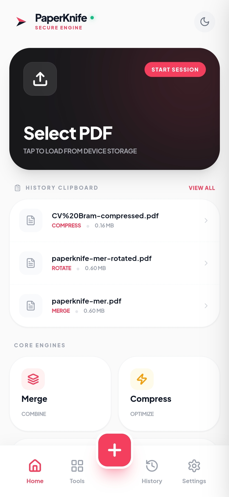
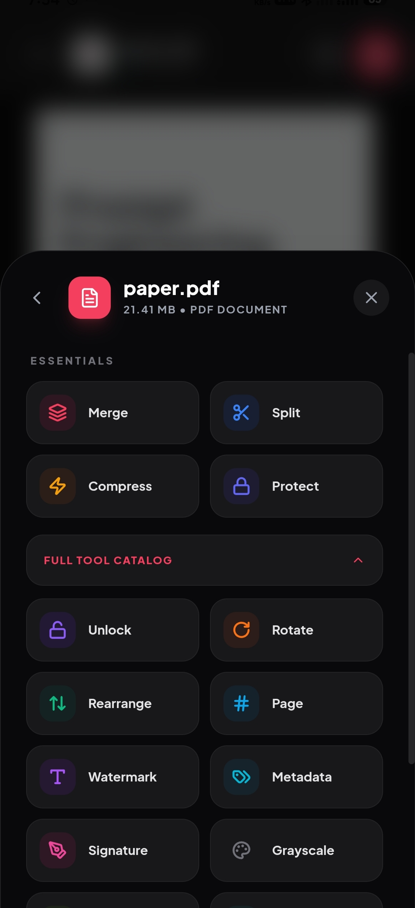

  

# PaperKnife

**A simple, honest PDF utility that respects your privacy.**

---

## Preview

  
  

---

### Why I built this

Most PDF websites ask you to upload your sensitive documents—bank statements, IDs, contracts—to their servers. Even if they promise to delete them, your data still leaves your device and travels across the internet.

I built **PaperKnife** to solve this. It's a collection of tools that run entirely in your browser or on your phone. Your files never leave your memory, they aren't stored in any database, and no server ever sees them. It works 100% offline.

### What it can do

*   **Modify:** Merge multiple files, split pages, rotate, and rearrange.
*   **Optimize:** Reduce file size with different quality presets.
*   **Secure:** Encrypt files with passwords or remove them locally.
*   **Convert:** Convert between PDF and images (JPG/PNG) or plain text.
*   **Sign:** Add an electronic signature to your documents safely.
*   **Sanitize:** Deep clean metadata (like Author or Producer) to keep your files anonymous.

### How to use it

*   **On Android:** Download the [latest APK](https://github.com/zafajardo9/PaperKnife/releases/latest) or get it from:

*   **On the Web:** Visit the [live site](https://zafajardo9.github.io/PaperKnife/). You can use it like any other website, or "install" it as a PWA for offline access.

---

### Support the project

PaperKnife is a free, open-source, ad-free, and tracker-free tool because privacy is a right, not a luxury.

If this tool has saved you time or kept your data safe, please consider:
*   **Giving a Star:** It helps other people find the project.
*   **Spreading the word:** Share it with anyone who handles sensitive documents.

---

### Under the hood

PaperKnife is built with **React** and **TypeScript**. The core processing is handled by **pdf-lib** and **pdfjs-dist**, which run in a sandboxed environment using WebAssembly. The Android version is powered by **Capacitor**.

This project is licensed under the **GNU AGPL v3** to ensure it remains open and transparent forever.

---
*Made with care by [Zackery Alline Fajardo](https://github.com/zafajardo9)*
